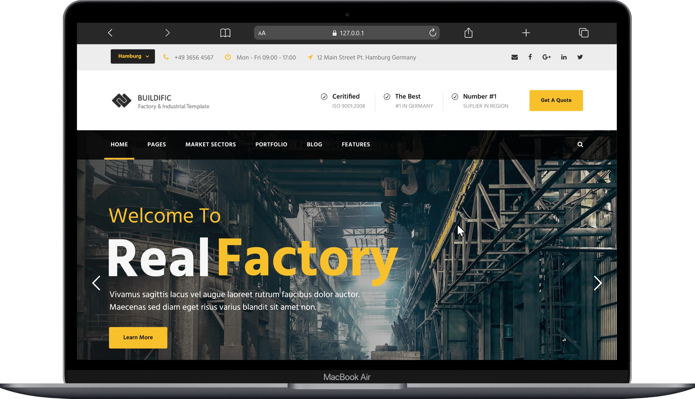

# Real Factory — HTML Template for Factory / Industry / Construction

[](https://github.com/dresar/beko)
[](#)
[](#)
[](#)
[](#)

---

## 🇮🇩 Ringkasan Singkat (Short Description - Indonesian)
**Real Factory** adalah template HTML profesional dan kaya fitur yang dirancang khusus untuk sektor industri, pabrik, konstruksi, teknik (engineering), logistik, dan sejenisnya. Template ini menyediakan berbagai pilihan beranda (homepage), tata letak galeri portofolio, ragam artikel blog, serta puluhan komponen UI siap pakai yang disesuaikan untuk kebutuhan bisnis industrial modern.

## 🇬🇧 Short Description (English)
**Real Factory** is a professional, feature-rich HTML template designed specifically for factories, industrial operations, construction companies, engineering businesses, logistics, and related fields. It offers a variety of homepage variations, portfolio layouts, blog variations, and dozens of pre-built UI components tailored to meet the needs of modern industrial enterprises.

---

## 📸 Showcase & Preview
Berikut adalah beberapa cuplikan tampilan website dari template **Real Factory** yang responsif dan elegan:

<p align="center">
  
  
</p>
<p align="center">
  
  
</p>
<p align="center">
  
  
</p>

---

## 🛠️ Technology Stack
Template ini dibuat dengan performa tinggi menggunakan pustaka web standar industri:
- **Core Structure**: HTML5 & CSS3 (Semantic markup, layout yang bersih).
- **Interactivity**: JavaScript (ES6+) & **jQuery v3.x** untuk manipulasi DOM dan efek transisi.
- **Styling Customization**: Custom stylesheets (`css/style-core.css`, `css/rftr-style-custom.css`) yang memfasilitasi kustomisasi tema secara fleksibel.
- **Sliders & Carousels**: **Revolution Slider** (`plugins/revslider`) untuk animasi slideshow beresolusi tinggi di bagian banner utama.
- **Layout & Elements**: **GoodLayers Core Page Builder** untuk integrasi widget, tombol, box, dan elemen halaman terstruktur.
- **Contact Forms**: **Quform Framework** untuk validasi form kontak interaktif.
- **Icons & Fonts**: Font Awesome & Google Fonts (Hind, Roboto, dll.) untuk tipografi premium.

---

## 📄 Deskripsi Lengkap Website (Full Description)

<details open>
<summary><b>🇮🇩 Bahasa Indonesia</b></summary>
<p></p>

**Real Factory** menyediakan paket situs web lengkap untuk menampilkan kredibilitas dan kapabilitas bisnis manufaktur atau konstruksi Anda. Template ini menyertakan halaman khusus untuk:
*   **4 Pilihan Beranda (Homepage)**: Desain beranda yang berbeda dengan slider interaktif, penekanan video, dan informasi bisnis strategis.
*   **Market Sectors (Sektor Pasar)**: Halaman khusus yang siap pakai untuk *Automotive Parts & System*, *Construction & Engineering*, *Power & Energy*, *Aero Space*, *Ship Building Industry*, dan *Railway*.
*   **Sistem Portofolio Lengkap**: Menampilkan hasil proyek dengan gaya Grid (2 hingga 5 kolom, dengan atau tanpa jarak), gaya Modern, dan tata letak Side Thumbnail (thumbnail di kiri/kanan).
*   **Variasi Halaman Blog**: Format penuh (full-width), layout dengan sidebar kiri, kanan, atau ganda, serta tampilan grid artikel berita.
*   **Komponen UI Kustom**: Dilengkapi dengan puluhan elemen pendukung seperti Accordions, Alert Boxes, Testimonials, Flip Boxes, Counter data, Skill Bars, Price Tables, serta navigasi tab horizontal dan vertikal.
</details>

<details>
<summary><b>🇬🇧 English</b></summary>
<p></p>

**Real Factory** provides a complete website package to showcase the credibility and capability of your manufacturing or construction business. This template includes dedicated layouts for:
*   **4 Homepage Variations**: Different homepage designs featuring interactive sliders, video backgrounds, and strategic business data highlights.
*   **Market Sectors**: Pre-built pages specialized for *Automotive Parts & System*, *Construction & Engineering*, *Power & Energy*, *Aero Space*, *Ship Building Industry*, and *Railway*.
*   **Robust Portfolio System**: Project showcases in Grid style (2 to 5 columns, with or without padding), Modern style, and Side Thumbnail layouts (left/right positioning).
*   **Blog Variations**: Full-width formats, left/right/double sidebar layouts, and grid systems for news items.
*   **Custom UI Components**: Dozens of pre-designed supporting elements including Accordions, Alert Boxes, Testimonials, Flip Boxes, Counter circles, Skill Bars, Price Tables, and horizontal/vertical tab navigations.
</details>

---

## 🤖 Ringkasan AI (7 AI Summaries)
> [!NOTE]
> Berikut adalah 7 poin penting mengenai struktur, kelebihan, dan fungsionalitas template **Real Factory** berdasarkan analisis berkas sumber:

1. 🏭 **Dirancang Khusus untuk Industri Heavy-duty**: Struktur konten dan estetika template dikuratori secara optimal untuk industri alat berat, manufaktur, teknik sipil, perkapalan, dan kedirgantaraan.
2. 🗂️ **Arsitektur Multi-Page yang Sangat Lengkap**: Berisi lebih dari 80+ file HTML siap pakai yang mencakup seluruh halaman utama, portofolio, kontak, halaman blog, hingga halaman utilitas seperti 404, Coming Soon, dan Maintenance.
3. 🚀 **Animasi Banner Dinamis**: Menggunakan integrasi Revolution Slider untuk menampilkan transisi banner beresolusi tinggi, visualisasi pabrik, dan video latar yang mulus.
4. 📱 **Responsive & Mobile-First**: Dioptimalkan sepenuhnya agar tampil prima di berbagai ukuran perangkat, mulai dari monitor desktop, tablet, hingga smartphone layar kecil.
5. 📂 **Galeri Portofolio Modular**: Menyediakan fleksibilitas tinggi bagi pengembang untuk memamerkan proyek pembangunan dengan opsi tata letak modern dan side-thumbnail.
6. ✉️ **Form Formulir Siap Pakai**: Integrasi Quform dan Google Map memudahkan pengguna dalam membangun kontak dinamis, pengajuan penawaran harga (quote), dan peta lokasi kantor.
7. ⚡ **Ringan & Siap Deploy**: Karena berbasis HTML statis tanpa kompilasi server-side yang rumit, situs web ini dapat langsung dihosting secara cepat dan murah melalui GitHub Pages, Vercel, Netlify, atau web hosting biasa.

---

## 🚀 Cara Menjalankan Website (How to Run)

Karena proyek ini adalah template situs web statis (HTML, CSS, JS), Anda tidak memerlukan proses instalasi dependensi atau *build* (seperti `npm install` atau `npm run build`) untuk menjalankannya. Anda dapat memilih salah satu metode di bawah ini:

### Metode 1: Buka Berkas Secara Langsung (Paling Mudah)
1. Buka folder proyek **beko**.
2. Cari berkas `index.html`.
3. Klik ganda (double-click) pada berkas tersebut untuk membukanya secara langsung di peramban (browser) pilihan Anda (Chrome, Edge, Firefox, Safari).

### Metode 2: Menggunakan Ekstensi VS Code Live Server (Direkomendasikan untuk Development)
Jika Anda menggunakan Visual Studio Code:
1. Buka folder proyek di VS Code.
2. Pasang ekstensi **Live Server** oleh Ritwick Dey dari marketplace.
3. Klik kanan pada berkas `index.html` dan pilih **Open with Live Server** (atau klik tombol **Go Live** di bilah status kanan bawah).
4. Website akan terbuka secara otomatis pada alamat lokal: `http://127.0.0.1:5500/index.html`.

### Metode 3: Menggunakan Node.js `http-server` (Menggunakan Terminal)
Jika Anda telah memasang Node.js pada sistem Anda:
1. Buka terminal atau Command Prompt/PowerShell pada direktori proyek.
2. Jalankan perintah berikut:
   ```bash
   npx http-server .
   ```
3. Terminal akan menampilkan alamat host lokal Anda (biasanya `http://127.0.0.1:8080`).
4. Buka alamat tersebut di peramban Anda.

### Metode 4: Menggunakan Python Server
Jika sistem Anda telah terpasang Python:
1. Buka terminal pada direktori proyek.
2. Jalankan perintah di bawah ini sesuai versi Python Anda:
   * **Python 3**:
     ```bash
     python -m http.server 8000
     ```
   * **Python 2**:
     ```bash
     python -m SimpleHTTPServer 8000
     ```
3. Buka peramban Anda lalu kunjungi `http://localhost:8000`.

---

## 🔗 Repository GitHub
Proyek ini disimpan di GitHub pada tautan berikut:
👉 [https://github.com/dresar/beko](https://github.com/dresar/beko)
